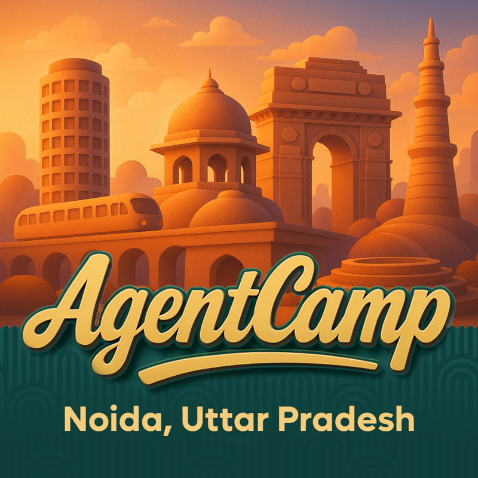

# AgentCamp Noida — 28 February 2026

Session resources from **AgentCamp Noida**, part of the global AgentCamp bootcamp series by the [Global AI Community](https://globalai.community).

**Date:** 28 February 2026
**Time:** 10:00 AM – 3:00 PM IST
**Venue:** HROne Office, Noida, India

---

## About AgentCamp

[AgentCamp](https://globalai.community/agentcamp/) is a free, community-run AI bootcamp series organized by local chapters of the [Global AI Community](https://globalai.community) worldwide. It brings together practitioners, engineers, and builders to learn from experts, share real-world experience, and explore the latest in AI — agents, LLMs, toolchains, and more.

- **75 locations** across **28 countries**
- **300+ hours** of AI content globally
- **Free to attend** — no barriers to participation

The Noida edition was hosted at HROne Office and featured 4 sessions covering AI agents, LLM optimization, AI-assisted engineering, and AIOps.

---

## How to use this repo

Each session folder contains:
- A **README** with key concepts, takeaways, and further reading
- The **slide deck** (PDF) from the session
- Any **code, notebooks, or demos** shared within the session

Whether you attended and want to revisit, or discovered this repo later — everything you need to go deeper is here.

---

## Sessions

### 10:30 AM – 11:00 AM — Smart AI Agents: Think, Act, and Automate Tasks for You

**Speaker:** [Sunny Sharma](https://www.linkedin.com/in/sunnyksharma)

What makes an AI agent *think*? This session answers that from first principles — why standalone LLMs can't act, what separates an agent from a chatbot, and how the ReAct loop (Thought → Action → Observation) is the engine of agent reasoning. Also covers tool use, RAG, MCP architecture, and real-world patterns (multi-agent, reflection, human-in-the-loop, plan & execute), with a learning path for engineers ready to start building.

[Session folder →](Smart%20AI%20Agents%20Think%2C%20Act%2C%20and%20Automate%20Tasks%20for%20You%20by%20Sunny%20Sharma/)

---

### 11:00 AM – 1:00 PM — Using Optimizers with LLM *(Hands-on Workshop)*

**Speakers:** [Nirmal Vatsyayan](https://www.linkedin.com/in/nirmal-vatsyayan-65189016) & [Khush Joshi](https://www.linkedin.com/in/khush-joshi-b4501724b)

A hands-on workshop on improving LLM output quality through systematic optimization techniques. Covers LLM-as-a-Judge for scalable evaluation, the GEPA methodology for iterative prompt refinement, and knowledge distillation from larger to smaller models. 

[Session folder →](Using%20Optimizers%20with%20LLM%20by%20Nirmal%20Vatsyayan%20and%20Khush%20Joshi/)

---

### 2:00 PM – 2:30 PM — AI-Assisted Engineering: A Working Engineer's Playbook

**Speaker:** [Satyam Mishra](https://www.linkedin.com/in/satyamml)

Practical engineering discipline for AI-assisted development. Covers spec-driven development (6-component spec anatomy), adversarial code review (5-point checklist), and a repeatable toolchain: project config files, slash commands, skills folders, parallel worktrees, and Playwright MCP.

[Session folder →](AI-Assisted%20Engineering%20A%20Working%20Engineers%20Playbook%20by%20Satyam%20Mishra/)

---

### 2:30 PM – 3:00 PM — Build Your Own AIOps Agent Using MCP

**Speaker:** [Shiv Kumar Sah](https://www.linkedin.com/in/shivkumarsah)

A practical session on building a privacy-first AIOps agent using MCP. Covers MCP architecture (JSON-RPC over stdio), running local LLMs via Ollama, and the InfraGPT-MCP demo project — a fully local infrastructure monitoring agent with system health scoring, security log analysis, and performance monitoring.

**GitHub:** [shivkumarsah/InfraGPT-MCP](https://github.com/shivkumarsah/InfraGPT-MCP)

[Session folder →](Build%20Your%20Own%20AIOps%20Agent%20Using%20MCP%20by%20Shiv%20Kumar%20Sah/)

---

## Full Schedule

| Time | Session | Speaker |
|------|---------|---------|
| 10:00 – 10:30 | Registration | — |
| 10:30 – 11:00 | Smart AI Agents: Think, Act, and Automate Tasks for You | Sunny Sharma |
| 11:00 – 13:00 | Using Optimizers with LLM *(Workshop)* | Nirmal Vatsyayan & Khush Joshi |
| 13:00 – 14:00 | Lunch & Networking | — |
| 14:00 – 14:30 | AI-Assisted Engineering: A Working Engineer's Playbook | Satyam Mishra |
| 14:30 – 15:00 | Build Your Own AIOps Agent Using MCP | Shiv Kumar Sah |

---

## Community

Join the AI conversation on Discord — connect with speakers, attendees, and the broader Global AI Community:

**[gaic.io/discord](https://gaic.io/discord)**

---

*\#AgentCamp \#GlobalAICommunity*
